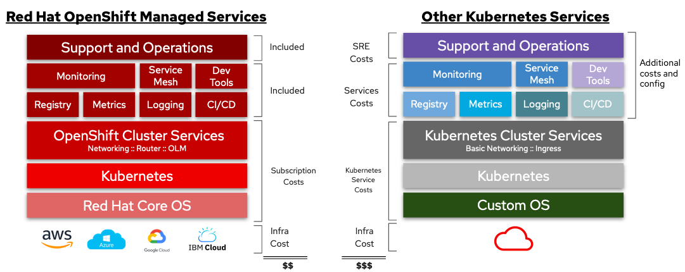
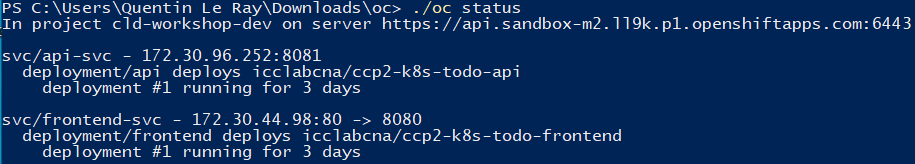

---
title: "CLD WorkShop - Openshift"
author: Groupe E [SP, OD, MD, QL, AF] 
date: "31-05-2021"
subject: "Openshift"
keywords: [Markdown, Example]
lang: "en"
titlepage: true
...

# CLD Workshop OpenShift

## Introduction
OpenShift est un service de plate-forme en tant que service de la société Red Hat qui permet de déployer des projets dans des containers. OpenShift utilise les technologies Docker et Kubernetes.

Le projet est open-source et peut-être auto-hébergé au sein de sa propre infrastructure.

## Principaux avantages/features

### Pour les Business leaders

- Disposer d'une infrastructure flexible (facilement déplaçable sur des infrastructure cloud ou de l'auto-hébergement)
- Accélerer la vitesse de déploiement et de développement

### Pour les opérateurs/sysadmin

- Compatible avec une infrastructure virtualisée (en auto-hébergement)
- Gestion des ressources centralisé (CPU, mémoire,...) 
- Gestion des *Image Stream* internes (image Docker de l'entreprise par ex.) pour les développeurs

### Pour les développeurs

- Permet la mise en place d'infrastructure de développement automatisé (Pipeline, worflow)
- Plus facile d'accès qu'un pure *Kubernetes* (couche d'abstraction avec le CLI ``odo``)

### Source de déploiement d'application

- Git
- Docker
- DevFile
- kubernetes

## Stratégie économique

Selon RedHat, nous gagnons au niveau:

- Temps de développement: mois -> semaines,
- Temps de déploiements en heures,
- Coût de build applicatifs réduits de 60%.

Quand hébergé sur AWS, OpenShift réduirait l'OpEx de 54% sur 5 ans, serait rentable en 5 mois, et aurait un retour sur investissement de 661% sur 5 ans.

L'usage simultané de cloud on-premises et public permettent d'avoir une flexibilité et agilité particulièrement intéressante pour viser différents types de marchés avec des besoins mutuellement exclusifs. Couplé aux gains temporels et financiers, cette technologie a le potentiel de rendre une entreprise nettement plus compétitive.

### On-premise vs self-managed

Si l'on considère une infrastructure auto-géré il sera nécéssaire d'y inclure les coût d'achat de matériel ainsi que les coût de maintenance, ces derniers sont inclus dans une offre *On-premise* (infrastructure est hébergé chez un fournisseur cloud tier).





Les offres d'hébergements chez les différents fournisseurs Cloud proposés par _Red hat_ sont détaillé ci-dessous:


# Example d'utilisation d'Openshift - CLI

Les utilisateurs d'Openshift, qu'ils soit administrateur ou développeur disposent d'outils en ligne de commande adaptés à leurs situations : ``oc`` et ``odo`` :

### OC

``oc`` permet la création d'application conteneurisés ainsi que la gestion de la plateforme de puis la ligne de commande, utilisé de préférence par les administrateurs de la plateforme

```bash
# crée une nouvelle application depuis github
$ oc new-app https://github.com/sclorg/cakephp-ex

# inspecter les logs d'une application
$ oc logs cakephp-ex-1-deploy
```



### ODO

``odo`` est l'interface pour ligne de commande qui allège la complexité de ``kubernetes`` , cela permet aux développeurs de facilement déployer leurs applications .

```bash
# Se connecter à la plateforme
$ odo login -u developer -p developer

# lister les composant (supporté ou non-supporté)
$ odo catalog list components

# Suppression d'une application
$ odo app delete myapp

# Obtenir la description d'une application
$ odo app describe webapp

 # Créer un composant à partir d'une image NodeJS avec les sources du dossier "frontend"
$ odo create nodejs frontend --context ./frontend

```


