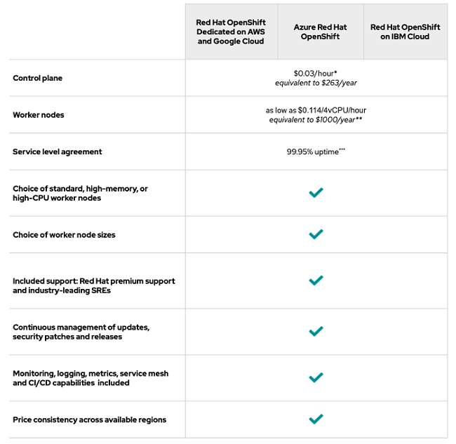

---
title: "Openshift"
author: [CLD - Groupe E]
date: "31-05-2021"
subject: "Openshift"
keywords: [Markdown, Example]
lang: "en"
...

# CLD Workshop OpenShift

## Introduction
OpenShift est un service de plate-forme en tant que service de la société Red Hat qui permet de déployer des projets dans des containers. OpenShift utilise les technologies Docker et Kubernetes.

Le projet est open-source et peut-être auto-hébergé au sein de sa propre infrastructure.

## Principaux avantages/features

### Pour les Business leaders

- Disposer d'une infrastructure flexible (facilement déplaçable sur des infrastructure cloud ou de l'auto-hébergement)
- Accélerer la vitesse de déploiement et de développement

### Pour les opérateurs/sysadmin

- Compatible avec une infrastructure virtualisée (en auto-hébergement)
- Gestion des ressources centralisé (CPU, mémoire,...) 
- Gestion des *Image Stream* internes (image Docker de l'entreprise par ex.) pour les développeurs

### Pour les développeurs

- Permet la mise en place d'infrastructure de développement automatisé (Pipeline, worflow)
- Plus facile d'accès qu'un pure *Kubernetes* (couche d'abstraction avec le CLI ``odo``)

### Source de déploiement d'application

- Git
- Docker
- DevFile
- kubernetes

## Stratégie économique

Selon RedHat, nous gagnons au niveau:

- Temps de développement: mois -> semaines,
- Temps de déploiements en heures,
- Coût de build applicatifs réduits de 60%.

Quand hébergé sur AWS, OpenShift réduirait l'OpEx de 54% sur 5 ans, serait rentable en 5 mois, et aurait un retour sur investissement de 661% sur 5 ans.

L'usage simultané de cloud on-premises et public permettent d'avoir une flexibilité et agilité particulièrement intéressante pour viser différents types de marchés avec des besoins mutuellement exclusifs. Couplé aux gains temporels et financiers, cette technologie a le potentiel de rendre une entreprise nettement plus compétitive.

### On-premise vs self-managed

Si l'on considère une infrastructure auto-géré il sera nécéssaire d'y inclure les coût d'achat de matériel ainsi que les coût de maintenance, ces derniers sont inclus dans une offre *On-premise* (infrastructure est hébergé chez un fournisseur cloud tier).

Les prix de l'hébergement selon Red-Hat:

# Example d'utilisation d'Openshift

Les utilisateur d'Openshift, qu'ils soit administrateur ou développeur dispose d'outil adapté à leur situation: ``oc`` et ``odo``

